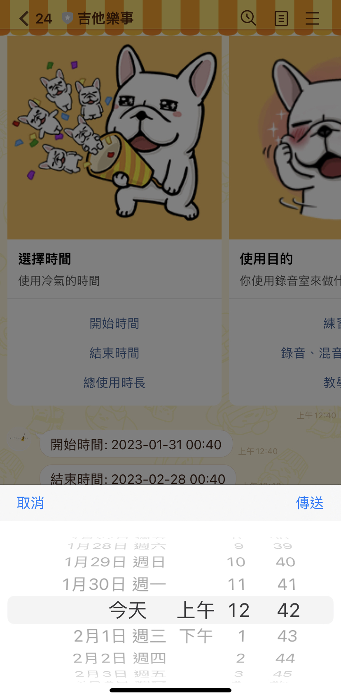

# Guitarous Line Bot

串接 Line Bot 與 google sheet，用來記錄[吉他樂事](https://www.youtube.com/@guitarous402)工作室的冷氣使用。

## 功能

- 選擇使用工作室的開始與結束時間
- 使用目的
- 送出前可以檢視資料狀況
- 送出前驗證資料是否都有填寫、格式正不正確
- 自動依照使用者的 Line ID 去紀錄使用者姓名

## 連結

[Line 機器人帳號網址](https://line.me/R/ti/p/@951hqsrx)

**QRCode**

## 介面

**Google Sheet**

  

  

  

  

## 更新流程

1. commit all change
2. npm run build
3. git push
